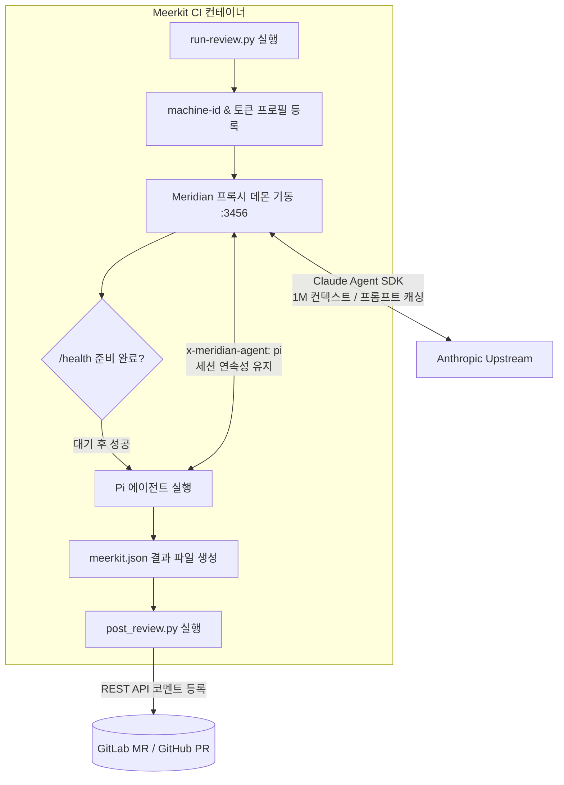

# Meerkit

Meerkit 은 MR/PR 코드 리뷰를 자동화하는 CI 컨테이너이다.

코딩 에이전트인 pi 를 헤드리스 모드로 실행하여 코드 변경분을 리뷰하고, 그 결과를 GitLab MR 의
인라인 discussion 이나 GitHub PR 의 리뷰 코멘트로 게시한다. 실행 중인 호스팅 플랫폼의 종류는
환경변수를 통해 자동으로 판별한다.

이름은 무리를 위해 보초를 서는 동물인 미어캣(meerkat)에서 가져왔다.

## 동작 구조



## 구성

```text
meerkit/
├── Dockerfile                  # CI 이미지 빌드 정의
├── run-review.py               # 잡 진입점 (Meridian 수명주기 및 pi 실행 관리)
├── post_review.py              # 호스팅 플랫폼 REST API 코멘트 게시
├── forge.py                    # GitLab/GitHub 차이 추상화 어댑터
├── config/
│   ├── models.json             # Pi 의 Meridian 프로바이더 및 모델 정의
│   ├── sdk-features.json       # Team 플랜 호환성 설정 (billing_error 방지)
│   └── extensions/             # 세션 연속성 및 프롬프트 캐시 유지 익스텐션
├── prompt/
│   ├── review.md               # 리뷰 규칙 및 출력 JSON 스키마 지시문
│   └── fluent-korean.md        # 한국어 문장 서술 품질 지침
├── tests/                      # 가짜 호스팅 플랫폼 기반 단위 테스트 스위트
├── Taskfile.yaml               # 빌드, 테스트, 푸시 태스크 정의
└── local-runner/               # 로컬 테스트용 GitLab Runner 구성
```

| 경로 | 역할 |
|---|---|
| `Dockerfile` | pi 와 meridian 프록시, 리뷰 스크립트를 함께 빌드하는 CI 이미지이다 |
| `run-review.py` | 잡 진입점이다. diff 범위를 계산하고 meridian 과 pi 를 실행한 뒤 결과를 게시한다 |
| `post_review.py` | JSON 결과를 인라인 코멘트로 게시한다. 본문 렌더링과 게시 순서를 담당한다 |
| `forge.py` | GitLab 과 GitHub 의 REST 어댑터이다. 플랫폼별 API 차이를 흡수한다 |
| `config/models.json` | Pi 가 로컬 Meridian 프록시를 인식하도록 구성한 모델 정의 파일이다 |
| `config/sdk-features.json` | Team 플랜 환경에서 billing_error 를 방지하기 위한 프롬프트 설정이다 |
| `config/extensions/` | 도구 실행 턴에서 프롬프트 캐시 적중률(90%+)을 유지하는 익스텐션이다 |
| `prompt/review.md` | 리뷰 지시문이다. 결과를 엄격한 JSON 스키마에 맞추어 작성하게 한다 |
| `prompt/fluent-korean.md` | 한국어 문장 지침이다. 리뷰 프롬프트 본문 하단에 결합된다 |
| `tests/` | 가짜 호스팅 플랫폼 서버를 대상으로 실행하는 게시 로직 테스트이다 |
| `Taskfile.yaml` | 빌드와 푸시, 검증, 테스트, 러너 관리 태스크를 정의한다 |
| `local-runner/` | 테스트용 로컬 GitLab Runner 환경이다 |

리뷰 로직은 모두 이미지 내부(`/opt/meerkit/`)에 고정되어 있다. 리뷰 대상 저장소를 체크아웃한
경로에서는 실행하지 않는데, 변경 작성자가 스크립트나 프롬프트를 수정하여 잡에 주입된 토큰을
탈취하는 보안 위협을 방지하기 위함이다.

같은 이유로 `pi-gitlab` 과 같은 호스팅 플랫폼 확장은 이미지에 포함하지 않는다. 결과 게시는
`post_review.py` 가 REST API 를 직접 호출하여 안전하게 처리하며, 확장을 포함하면
`--approve` 옵션으로 실행되는 에이전트에게 쓰기 권한을 지닌 도구를 노출하게 되기 때문이다.

## 사용하는 쪽 설정

이 저장소를 직접 참조할 필요는 없으며, 이미지 태그 하나만 연결하면 동작한다.

### GitLab CI

도입하려는 프로젝트의 `.gitlab-ci.yml` 에 아래 내용을 추가한다.

```yaml
meerkit:
  stage: test
  needs: []
  image: ghcr.io/<owner>/meerkit:latest
  # tags:
  #   - your-runner-tag
  allow_failure: true
  variables:
    # 머지 베이스 커밋을 계산하려면 전체 커밋 이력이 필요하다.
    GIT_DEPTH: "0"
  script:
    - /opt/meerkit/run-review.py
  artifacts:
    when: always
    paths:
      - meerkit.json
    expire_in: 7 days
  rules:
    - if: '$CI_PIPELINE_SOURCE == "merge_request_event"'
      when: manual
```

### GitHub Actions

`.github/workflows/meerkit.yml` 에 아래 내용을 추가한다.

```yaml
name: meerkit
on: pull_request

permissions:
  contents: read
  pull-requests: write   # 없으면 GITHUB_TOKEN 이 읽기 전용이라 게시가 실패한다

jobs:
  review:
    runs-on: ubuntu-latest
    container:
      image: ghcr.io/<owner>/meerkit:latest
    steps:
      - uses: actions/checkout@v4
        with:
          # 머지 베이스 계산을 위해 전체 히스토리를 가져온다.
          fetch-depth: 0
      - run: /opt/meerkit/run-review.py
        env:
          CLAUDE_CODE_OAUTH_TOKEN: ${{ secrets.CLAUDE_CODE_OAUTH_TOKEN }}
          GITHUB_TOKEN: ${{ secrets.GITHUB_TOKEN }}
      - uses: actions/upload-artifact@v4
        if: always()
        with:
          name: meerkit
          path: meerkit.json
```

주의할 점은 아래와 같다.

- **러너가 이미지를 내려받을 수 있어야 한다.** 프라이빗 레지스트리는 GitHub 호스티드
  러너에서 접근할 수 없다. GHCR 과 같은 공개 레지스트리로 푸시한 뒤
  `task push REGISTRY=ghcr.io/<owner> IMAGE=meerkit` 으로 태그를 일치시킨다.
- **이미지 아키텍처는 amd64 여야 한다.** 호스티드 러너는 x86_64 환경이다. `task build` 의
  기본값이 여기에 해당하며, `task build:local` 로 빌드한 arm64 이미지는 호스티드 환경에서 동작하지 않는다.
- **포크에서 생성된 PR 에는 게시할 수 없다.** `GITHUB_TOKEN` 이 읽기 전용 권한으로
  주입되기 때문이다. `pull_request_target` 이벤트를 사용하면 우회할 수 있으나, 이 방식은
  PR 의 코드를 신뢰된 컨텍스트에서 실행하는 것이므로 위협 모델과 정면으로 충돌한다.
- GitLab 의 `when: manual` 에 대응하는 기능이 GitHub Actions 에는 기본 제공되지 않는다. 수동 실행이
  필요하다면 `workflow_dispatch` 나 라벨 트리거를 별도로 구성한다.

## 필요한 환경 변수

| 변수 | 필수 | 용도 및 설명 |
|---|---|---|
| `CLAUDE_CODE_OAUTH_TOKEN` | 예 | 모델을 호출하기 위한 OAuth 토큰이다. 없으면 잡이 실패한다 |
| `PI_GITLAB_TOKEN` | GitLab | MR 에 인라인 코멘트를 게시한다. 없으면 게시를 건너뛰고 아티팩트만 남긴다 |
| `GITHUB_TOKEN` | GitHub | PR 에 인라인 코멘트를 게시한다. 동작 방식은 위와 같다 |
| `MEERKIT_MODEL` | 아니오 | 사용할 모델 식별자이다. 기본값은 `meridian/claude-sonnet-5` 이다 |
| `MEERKIT_PROFILE_STRATEGY`| 아니오 | 다중 토큰 로드 밸런싱 정책이다 (`random` 또는 `first`, 기본값 `random`) |
| `MEERKIT_PROFILE` | 아니오 | 특정 프로필을 시작 계정으로 강제 지정할 때 사용한다 |
| `MEERKIT_THINKING` | 아니오 | 추론 강도를 지정한다 (`off` 부터 `max` 까지 설정 가능) |
| `MEERKIT_JSON` | 아니오 | 리뷰 결과 산출물 경로이다. 기본값은 `meerkit.json` 이다 |
| `MEERKIT_FORGE` | 아니오 | 호스팅 플랫폼을 강제로 지정한다 (`gitlab` 또는 `github`) |
| `MEERKIT_DIFF_BASE` | 아니오 | 리뷰 기준 커밋을 수동으로 지정한다. CI 외부에서 시험할 때 쓴다 |

GitLab 에서는 위 변수를 모두 **Masked ✅ / Protect ❌** 로 등록해야 한다.
Protect 를 활성화하면 source 브랜치와 target 브랜치가 **둘 다** protected 상태일 때만
변수가 주입되므로, 일반 기능 브랜치에서 생성한 MR 에서는 변수가 비어 있게 된다.

### CLAUDE_CODE_OAUTH_TOKEN 발급 및 다중 계정 로드 밸런싱

로컬에서 한 번만 발급받아 CI 환경변수에 사전에 주입하면 된다. 유효 기간이 긴 토큰이므로
컨테이너 환경에서 브라우저 승인 절차를 거치지 않고 바로 동작한다.

```bash
claude setup-token   # 브라우저 승인 → sk-ant-oat01-... 출력
```

#### 다중 토큰 등록 및 로드 밸런싱
여러 계정의 토큰을 콤마(`,`)나 줄바꿈으로 구분하여 한꺼번에 전달할 수 있다.

```bash
# 콤마 구분 등록 예시
CLAUDE_CODE_OAUTH_TOKEN="sk-ant-oat01-alpha...,sk-ant-oat01-beta...,sk-ant-oat01-gamma..."

# 또는 프로필 이름 지정 예시
CLAUDE_CODE_OAUTH_TOKEN="main:sk-ant-oat01-alpha...,backup:sk-ant-oat01-beta..."
```

토큰이 여러 개 주어지면 스크립트가 다음과 같이 로드 밸런싱과 장애극복을 자동으로 구성한다.

```text
[입력된 토큰 풀: Alpha, Beta, Gamma]
       │
       ▼ (잡 시작 시 무작위 선택)
시작 계정: Beta 선택
       │
       ▼ (순환 배치로 Failover 순서 확정)
Meridian 라우팅 순서: [Beta ➔ Gamma ➔ Alpha]
       │
       ├─► 1순위(Beta)로 리뷰 진행
       └─► 5시간 사용량 쿼터 소진 시 2순위(Gamma)로 무중단 자동 전환
```

- **부하 분산**: 여러 잡이 실행될 때마다 시작 계정을 무작위(`random`)로 선택하여 특정 계정의 사용량이 편중되는 현상을 방지한다.
- **자동 장애극복 (Priority Failover)**: 선택된 계정의 사용량 쿼터가 소진되면, Meridian 이 풀에 등록된 다음 계정으로 자동 전환하여 파이프라인 중단 없이 리뷰를 완수한다.
- 고정된 순서로 시작하길 원한다면 `MEERKIT_PROFILE_STRATEGY=first` 로 설정한다.

### PI_GITLAB_TOKEN 발급

`CI_JOB_TOKEN` 으로는 MR 코멘트를 작성할 수 없으므로 별도의 토큰이 필요하다.

리뷰 대상 프로젝트에서 **Settings → Access tokens → Add new token** 으로 이동하여 아래와
같이 발급한다.

| 항목 | 값 |
|---|---|
| Name | `meerkit` |
| Role | `Developer` |
| Scopes | `api` |

발급된 값을 **Settings → CI/CD → Variables** 에 `PI_GITLAB_TOKEN` 이라는 이름으로
등록한다(Masked ✅, Protect ❌).

### GITHUB_TOKEN

이 토큰은 따로 발급하지 않는다. GitHub Actions 가 잡마다 주입하는 값을 그대로 사용하되,
워크플로 파일에 `permissions: pull-requests: write` 권한을 명시해야 한다.

## 두 플랫폼 간의 처리 차이

`forge.py` 어댑터가 플랫폼별 동작 차이를 흡수하여 동일한 결과물을 도출한다.

| 구분 | GitLab | GitHub |
|---|---|---|
| 인라인 게시 | `POST .../discussions` + `position[*]` | `POST .../pulls/{n}/comments` |
| 요약 게시 | `POST .../notes` | `POST .../issues/{n}/comments` |
| 인증 방식 | `PRIVATE-TOKEN` 헤더 + form-urlencoded | `Bearer` 토큰 + JSON 본문 |
| diff 밖 라인 거부 | 400 Bad Request | 422 Unprocessable Entity |
| 게시 주체 확인 | `GET /user` API 호출 가능 | 불가 (설치 토큰 제한) |
| 리뷰 기준 커밋 | `CI_MERGE_REQUEST_DIFF_BASE_SHA` | `git merge-base` 로 정규화하여 계산 |

GitHub 은 리뷰 코멘트 생성에 2차 레이트 리밋을 적용하므로, 지적마다 1초의 간격을 두고 게시를 진행한다.
또한 diff 범위에 포함되지 않는 라인에 코멘트를 달아 422 오류가 발생하는 상황을 방지하기 위해,
게시 전에 `git diff --unified=0` 을 분석하여 실제 변경된 라인 집합에 속한 지적만 선별하여 전송한다.

## 한국어 문장 품질 관리

리뷰 본문은 개발자가 읽고 즉시 판단해야 하는 글이다. 일반적인 언어 모델은 조사와 어미를 생략하고
명사만 나열하는 압축된 번역투 문장을 작성하기 쉬워서 가독성이 떨어지는 문제가 있다.

[fluent-korean](https://github.com/snflkd/fluent-korean) 지침을 리뷰 프롬프트 본문 하단에
직접 결합하여 이 문제를 완화한다. 시스템 프롬프트 대신 유저 프롬프트에 결합하는 이유는,
Team 플랜 구독 환경에서 Anthropic 의 서드파티 프롬프트 차단(`billing_error`)을 방지하기 위해
`clientSystemPrompt` 설정을 비활성화하더라도 한국어 지침이 모델에 온전하게 전달되도록 하기 위함이다.

프롬프트 지침에 따라 모델은 다음과 같은 원칙을 지켜 리뷰 코멘트를 작성한다.
- 문장을 명사구로 끝맺지 않고 완성된 서술어로 마무리한다.
- 첫 문장에 핵심 결함을 명시하고, 구체적인 기술 근거를 목록 형태로 제시한다.
- 파일 식별자와 코드 경로는 백틱(`)으로 감싸며, 물결표 대신 명확한 행 범위를 표현한다.

## 프롬프트 캐시 최적화

에이전트가 도구(`read`, `bash` 등)를 실행하며 리뷰를 진행할 때, 세션 식별자가 전달되지 않으면
Meridian 이 해당 턴을 독립된 세션으로 판단하여 이전 대화 이력 전체를 매번 새로 전송하는
문제가 발생할 수 있다 (Meridian 이슈 #734). 이 경우 캐시 적중률이 40% 안팎으로 급락하고
입력 토큰 소모량이 매 턴 수만 개씩 치솟게 된다.

이미지 내부에 포함된 `config/extensions/meridian-session.ts` 익스텐션은 Pi 가 모델에 요청을 보내기
직전에 세션 식별자를 `metadata.user_id` 에 자동으로 주입한다. Meridian 의 Pi 어댑터는 이 값을
바탕으로 도구 실행 턴에서도 동일 세션 연속성을 인식하므로, 프롬프트 캐시 적중률을 **90% 이상**으로 유지하여
토큰 소모와 실행 지연 시간을 대폭 절감한다.

## 개발 및 테스트

### 개발 환경

[uv](https://docs.astral.sh/uv/) 를 패키지 관리자로 사용한다. 프로덕션 실행 시에는 표준 라이브러리만
사용하므로 외부 의존성이 없으며, uv 는 Python 런타임 버전 고정과 개발 도구(`ruff`, `pytest`) 관리에 쓰인다.

```bash
uv sync        # .venv 생성 및 개발 도구 설치
task check     # ruff 린트 및 pytest 테스트 동시 실행
```

**Python 버전을 변경할 때는 `.python-version` 과 `Dockerfile` 의 `ARG PYTHON_VERSION` 을
함께 수정해야 한다.** 한쪽만 변경하면 로컬에서는 통과하지만 컨테이너 빌드 시점에 문법 오류가
발생할 수 있기 때문이다.

### 단위 테스트

```bash
task test     # uv run pytest 실행
```

`tests/mock_forge.py` 가 표준 라이브러리 HTTP 서버를 띄워 가짜 GitLab 과 GitHub 서버 역할을 수행한다.
실제 네트워크 연결이나 토큰, 도커 컨테이너가 필요하지 않으며 10여 초 안에 모든 검증이 완료된다.

목 서버 테스트를 통해 검증하는 항목은 다음과 같다.
- 인라인 코멘트 게시 순서 및 본문 렌더링 검증
- 인라인 게시가 거부되었을 때 상단 요약 노트로 자동 전환(폴백)되는지 여부
- 이전 파이프라인에서 작성된 기존 코멘트 갱신 및 삭제 처리 로직
- 다중 토큰 파싱, 무작위 로드 밸런싱 및 Meridian 프로필 등록 정상 동작 여부

### 컨테이너 이미지 빌드

```bash
task                 # 사용 가능한 태스크 목록 확인
task build           # amd64 이미지 빌드 (GitHub 호스티드 러너 등 클라우드 배포용)
task build:local     # arm64 네이티브 빌드 (Apple Silicon 로컬 러너 테스트용)
task verify          # 빌드된 이미지 내부 구성 요소 점검
task push            # 원격 레지스트리로 이미지 푸시
```

`Dockerfile` 의 레이어 순서는 캐시 효율성을 극대화하도록 배치되어 있다.
스크립트 복사(`COPY`) 단계가 맨 끝에 있으므로 프롬프트나 파이썬 코드를 수정하더라도
재빌드가 수 초 안에 완료된다. 반면 패키지 설치 단계를 수정하면 약 220MB 크기의 claude 바이너리를
다시 다운로드하게 되므로 주의가 필요하다.

### 로컬 시험 실행

로컬에 체크아웃된 저장소를 대상으로 리뷰 로직만 시험 실행할 수 있다(게시는 수행하지 않는다).

```bash
export CLAUDE_CODE_OAUTH_TOKEN="sk-ant-oat01-..."
task review REPO=/path/to/repo BASE=HEAD~2
```

로컬 GitLab Runner 환경은 `task runner:up` 과 `runner:logs`, `runner:down` 명령으로 간편하게 관리할 수 있다.
