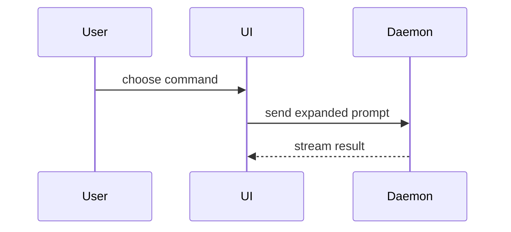

<!--
show-me (CI 판)
원본: pi 의 show-me 스킬 (~/.pi/agent/skills/show-me/SKILL.md)

원본은 대화 중인 사용자에게 화면으로 보여주는 것을 전제한다. Meerkit 은 사람이 없는
CI 잡이고 산출물은 MR/PR 코멘트라서, 다음 두 가지를 덜어내고 가져왔다.

- HTML 아티팩트 모드와 `Bash(open ...)` — 컨테이너에는 열 화면이 없고,
  GitLab 과 GitHub 은 코멘트 본문의 HTML 을 살균한다.
- "현재 대화 주제", "사용자의 지금 질문" 같은 대화형 전제 — 루프에 사람이 없다.

시각 표현의 어휘 자체는 원본을 그대로 유지한다.

프런트매터를 지켜 두었으므로 `pi --skill prompt/show-me` 로도 읽을 수 있다. 다만
Meerkit 은 그 경로를 쓰지 않는다 — config/sdk-features.json 이 clientSystemPrompt 를
끄기 때문에, pi 가 시스템 프롬프트에 실어 보내는 스킬 목록이 업스트림에 닿지 않는다.
run_review.py 가 이 본문을 유저 프롬프트에 직접 결합한다.
-->

구조를 말로만 풀어쓰지 말고 눈에 보이는 모양으로 보여준다. 군더더기 없이 짧게 쓰고,
요점이 드러나는 가장 작은 표현을 고른다.

- 로직이나 알고리즘은 의사코드로 보여준다.

```text
on(save)
  if content is unchanged
    return cached result
  write new content
  return fresh result
```

- 실행 시점의 제어 흐름은 호출 트리로 보여준다.

```text
submitForm
  createSession
    persistPrompt
    launchAgent
  navigateToSession
```

- UI 구조는 컴포넌트 트리로 보여준다. 의미가 있는 상태와 모듈 경계를 함께 적는다.

```tsx
<SessionPage> (apps/example/src/routes/session.tsx)
  useSessionEvents()
  <SessionToolbar>
    <RunSkillButton> (packages/ui)
```

- 파일의 책임 분담이나 넓은 리팩터링은 얕은 파일 트리로 보여준다.

```text
src/
├── commands/       # 사용자 동작을 해석한다
├── sessions/       # 세션 상태를 소유한다
└── transport/      # API 요청을 보낸다
```

- 컴포넌트 사이의 상호작용, 제어 흐름, 데이터 흐름은 Mermaid 로 보여준다.



- 주변 모양이 이미 있고 무엇이 달라졌는지가 요점이면 `diff` 를 쓴다. diff 의 모양을
  주제에 맞춘다.

컴포넌트 변경:

```diff
 <SessionPage>
   useSessionEvents()
   <SessionToolbar>
+    <RunSkillButton />
   <SessionTimeline>
+    <SkillResultCard />
```

파일 배치 변경:

```diff
 src/
 ├── commands/
+│   └── show-me.ts       # 슬래시 커맨드를 펼친다
 ├── sessions/
-└── transport.ts
+└── transport/
+    ├── client.ts
+    └── stream.ts
```

호출 트리나 콜 스택 변경:

```diff
 submitForm
   createSession
     persistPrompt
+    expandSkillMention
     launchAgent
-  navigateToSession
+  navigateToSession
+    subscribeToEvents
```

상태나 제어 흐름 변경:

```diff
 on(save)
-  write content
+  if content is unchanged
+    return cached result
+  write new content
+  invalidate cache
```

- 대부분이 새로 쓰인 코드이거나, 생략하면 소유권과 순서가 가려지거나, 목표 형태를 그대로
  가져다 쓸 수 있어야 할 때는 블록 전체를 보여준다.

```ts
function expandSkill(command: string): string {
  const skillName = command.slice(1)
  return `use the ${skillName} skill`
}
```

### 지침

각 시각 표현은 그것이 뒷받침하는 짧은 문장 옆에 둔다. 답하려는 질문에 필요한 호출, 파일,
속성, 상태, 경계만 남긴다.

위의 방식 중 하나만 쓸 수도 있고 몇 개를 겹쳐 쓸 수도 있다. 전부 쓰는 경우는 드물다.
판단해서 고르고, 읽는 사람을 압도하지 않는다.

### CI 코멘트에서 지킬 것

- 트리와 다이어그램의 라벨은 실제 식별자와 실제 경로로 쓴다. 지어낸 이름을 넣지 않는다.
- Mermaid 는 넓은 영역에만 쓴다. 인라인 코멘트는 가로 폭이 좁아 가로로 긴 다이어그램이
  잘린다. 그 자리에서는 텍스트 호출 트리를 쓴다.
- 코드 블록에는 언어를 붙인다. 언어가 없으면 `text` 로 둔다.
- diff 에 이미 보이는 코드를 그대로 옮겨 적지 않는다. 모양만 남기고 줄인다.
