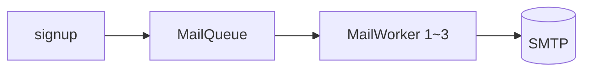

가입 인증 코드 발송이 `MailQueue` 를 거치도록 바뀌었다. 요청 스레드에서 SMTP 를 직접
물고 있던 구간이 사라지고, 재시도 책임이 큐 쪽으로 넘어갔다.

```mermaid
flowchart LR
    Signup[signup] --> Queue[MailQueue]
    Queue --> Worker[MailWorker 1~3]
    Worker --> SMTP[(SMTP)]
```

`src/auth.py` 가 변경의 중심이고 `src/notify.py` 는 그에 딸려 왔다.
재시도 제한이 1~5회 사이에서 어떻게 세어지는지부터 보면 된다.
